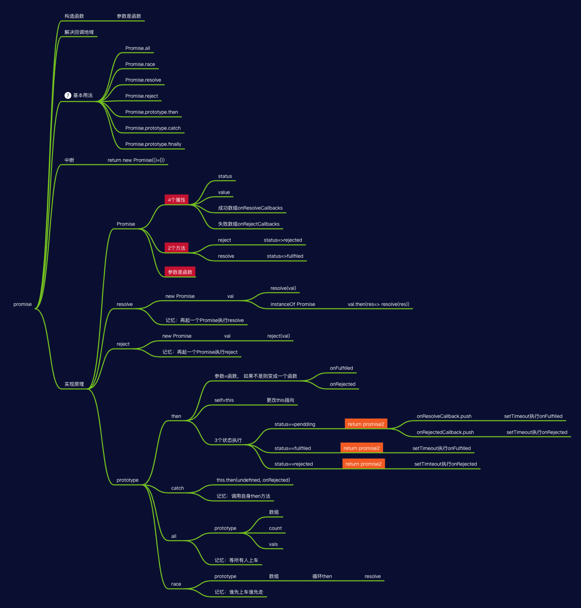

## 是什么

Promise:是异步编程的一种解决方案，一个函数

- 优点
  - 解决回调地域
  - 链式调用

## 怎么用

### 状态

- pending 进行中
- fulfilled 已成功
- rejected 已失败
  > 状态一经改变就不会再变化，任何时候都可以得到结果

### 流程


### 实例方法

- then
- catch
- finally

```js
const promise = new Promise(function(reslove, reject)=>{})
promise.then(res =>{})
promise.then(res =>{}).catch(error => console.log(error))
promise.then(res =>{}).catch(error => console.log(error)).finally(()=>console.log('end'))
```

### 构造函数方法

- all
- race
- resolve
- reject

```js
const p1 = new Promise(function(reslove, reject)=>{})
const p2 = new Promise(function(reslove, reject)=>{})
const p3 = new Promise(function(reslove, reject)=>{})
const res1 = Promise.all([p1, p2, p3]) // 全部要得到结果
const res2 = Promise.race([p1, p2, p3]) // 只要一个得到结果
Promise.resolve('result')
// ===
new Promsie(resolve => resolve('result'))

Promise.reject('reason')
// ===
new Promise((resolve, reject) => reject('reason'))
```

## 原理
- 链式调用原理？
每次都返回一个新的promise

- promise实现
  - 构造函数属性
    - status
    - value
    - onResolveCallbacks
    - onRejectCallbacks
  - 构造函数方法
    - resolve
    - reject 

## FAQ
