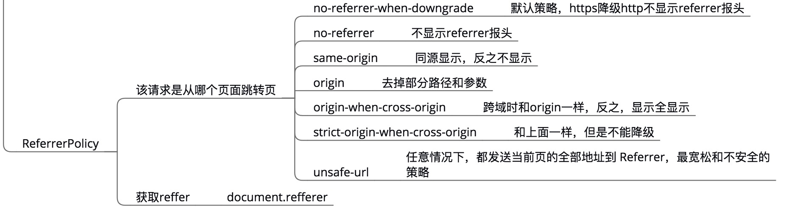

## 请求/返回头部
### 骨架
其实就2个部分，请求头部和返回头部，根据Chrome浏览器的设计，把公共的部分做为通用部分  
理解大部分参数的意思
### 通用部分
- Request Url
- Request Method
- Status Code 状态码 
- Remote Address 远端服务器地址
- ReferrerPolicy  referrer策略

### 请求头部
- Accept 请求格式
- Accept-Encoding 支持的压缩格式： gzip、deflate
- Accept-Language 支持的语言
- Connection 连接方式：keep-alive/close
- Content-Length 请求正文的长度： 检测截尾，是否传输完毕、分段报文
- Content-Type 请求内容格式： text/html, text/plain， applicatin/json， image/jpeg等
- chunk Transfer-Encoding，http1.1中 keep-alive  和content-length 二选一
- cookie cookie字符串
- Host 模板主机ip
- Origin 本机
- Reffer 包含一个URL，用户从该URL代表的页面出发访问当前请求的页面
- User-Agent 浏览器头部信息，内核版本等
- if-modified-since 最后一次修改时间和last-modified对应
- if-none-match etag的值
### 返回头部
- Connection keep-alive持续长连接和Request一样
- Content-Type 返回内容格式同Request
- Date GMT时间（格林时间，标准0时）
- Server 服务器名字
- Transfer-Encoding 分块编码 chunk http1.1 才有，例：This is the data in the first chunk\r\n，解决不知内容大小的问题
- set-cookie 设置cookie
- Cache-Control 缓存时间
- Expires 指明应该在什么时候认为文档已经过期，从而不再缓存它
- last-modified文档的最后改动时间
- Etag 字符串 如果没有变化返回304
- Vary告知缓存服务器按照 Accept-Encoding 字段的内容，分别缓存不同的版本Accept-Encoding
- X-Powered-By服务器用什么语言构建的