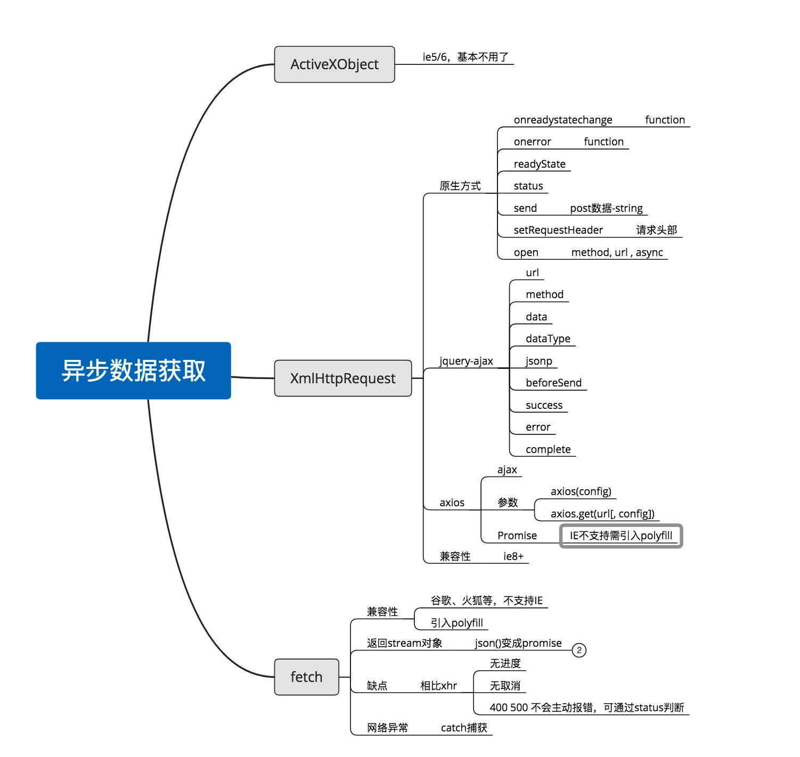

## ajax-axios-fetch区别
>前端数据交互从早起的ajax、jQuery的ajax，到后面的Promise、axios、fetch。有时候分不清它们的关系，容易混淆概念，为弄清楚这些相互紧密的技术或对象，整理此文！

### 一句话认识
1.  ajax 是使用 XmlHttpRequest 异步获取资源的技术，职责未分离，容易产生回调地狱。
2.  Promise 是可以把异步操作以同步操作的流程表达出来的一种形式或者一种解决方案，本质是 javascript 的一个对象（构造函数）。
3.  [axios 是一个使用XmlHttpRequest和Promise的为浏览器和Node.js设计的HTTP库](https:/www.kancloud.cn/yunye/axios/234845)
4.  fetch 是一种新的采用Promise方式的职责分离的异步获取资源的技术（新技术，需兼容）

### 发展历程
ajax--->jqueryAjax--->Promise--->axios--->fecth(不一定正确，从使用上可以这么理解吧)

### 区别

1.  ajax 和 fetch 属于同一类属性，是异步获取数据的技术，fecth是下一代的新技术， 需要兼容性支持
2.  promsie 本身是 javascript 对象，是一种解决方案，含有 3 个状态 pending(进行中)、fulfilled（已成功）、rejected（已失败），是axios和fetch的帮手
3.  axios 本质上是创建 XmlHttpRequest，兼容性会好，在回调方面采用了Promise,避免了回调地狱。
4.  fecth 引用了 Promise,支持 async await。
5.  IE天生不支持Promise,所以在IE上使用axios或fetch需要引入polyfill

### 上图理解
你现在对ajax Promise axios fetch有了一定的了解了吗？
###  错误回调处理
#### 现状
现在前端项目中基本使用ajax、axios和fetch来获取异步数据，基本使用方法及参数我就不做过多描述。    
这里主要讲的是面对4xx、5xx错误、网络错误的情况下，使用ajax、axios和fetch 怎么样进行错误处理。  
#### 经典案例
在发请求前有设置加载动画，在请求完成后，关闭加载动画！  
可能有些同学是在成功回调里设置了关闭加载动画，但是如果请求失败，那么加载动画会一直在运行。
#### 方案
1. 采用koa2搭建后台，可以设置请求返回码，测试4xx、5xx情况；
2. 利用Chrome的Network设置无网络，测试网络错误情况（Network offline）；
3. 依次观察原生ajax、jQuery-ajax、axios、fetch的错误表现；
##### 后台服务
```javascript
const fs  = require('fs');
const Koa = require('koa');
const Router = require('koa-router');
const cors = require('koa2-cors');
const app = new Koa();
const router = new Router();
const list = async (ctx, next) => {
  ctx.body='列表页';
}
/ 测试服务端4xx
const page404 =  (ctx, next) => {
  ctx.status = 404;
  ctx.body = '页面未找到'
}
/ 测试服务端5xx
const page500 =  (ctx, next) => {
  ctx.throw(500);
}
router.get('/', main)
      .get('/list', list)
      .get('/404', page404)
      .get('/500', page500)
app.use(router.routes());
app.listen(7100);
```
#### 前端用例
1. 生成4个按钮，相对应原生ajax、jQueryAjax、axios、fetch事件方法
```js
// react 构建demo
commonSendBefore = () => {
  this.setState({ loading: true });
};
commonCallback = () => {
  this.setState({ loading: false });
};
// 原生ajax
onClick1 = async () => {
  this.commonSendBefore();
  const xhr = new XMLHttpRequest();
  xhr.onreadystatechange = () => {
    if (xhr.readyState === 4) {
      if (xhr.status === 200) {
        console.log('success', xhr.responseText);
      } else {
        console.log('error-ajax', xhr);
        this.commonCallback();
      }
    }
  };
  xhr.open('GET', url, true);
  xhr.send();
};
// jqueryAjax
onClick2 = async () => {
  this.commonSendBefore();
  $.ajax({
    url,
    method: 'GET',
    success(res) {
      console.log('success', res);
    },
    error: (err) => {
      console.log('error-jquery-ajax', err);
      this.commonCallback();
    },
  });
};
// axios
onClick3 = async () => {
  this.commonSendBefore();
  axios(url)
    .then(
      (res) => {
        console.log('success', res);
      }
    )
    .catch((err) => {
        // console.log('error-axios', err.response);可以看到status
      console.log('err-axios', err);
    });
};
// fetch
onClick4 = async () => {
  this.commonSendBefore();
  fetch(url)
    .then((res) => {
      console.log('success-fetch', res);
    })
    .catch((err) => {
      console.log('error-fetch', err);
      this.commonCallback();
    });
};
```
1. 测试4xx错误
原生ajax和jQueryAjax 几乎一致，返回一个xhr对象，axios也是返回一个错误Error；  
但是fetch却截然不同，在success回调里返回相关信息；
测试结果：ajax、jQueryAjax、axios错误回调执行，加载动画消失，fetch错误回调未执行，加载动画依然存在。
1. 测试5xx错误
原生ajax和jQueryAjax 几乎一致，返回一个xhr对象，axios也是返回一个错误Error；  
但是fetch却截然不同，在success回调里返回相关信息；
测试结果：ajax、jQueryAjax、axios错误回调执行，加载动画消失，fetch错误回调未执行，加载动画依然存在。(同4xx错误一样)
1. 测试网络错误
原生ajax和jQueryAjax 几乎一致，返回一个xhr对象，axios也是返回一个错误Error，fetch错误回调执行；
测试结果：ajax、jQueryAjax、axios、fetch错误回调执行，加载动画消失。(同4xx错误一样)

综上测试可以得出以下：  
1. 4xx、5xx错误
ajax、jqueryAjax可以直接通过返回的对象中的status进行错误类型判断；
axios可以通过error.response中的status进行错误类型判断；
fetch可以通过返回的对象的status进行错误类型判断；
2. 网络错误  
ajax、jqueryAjax可以直接通过返回的对象中的status是否为0进行判断；
axios可以通过error.response是否为undefined进行错误类型判断；
fetch在catch中直接判断；
ajax、jqueryAjax、axios需要在错误回调中分析status码进行区别判断；
fetch中的catch处理网络错误，服务端错误需要在成功回调中根据status进行判断。
### 思维导图

###参考  
[fetch和XmlHttpRequest讲解](https:/blog.csdn.net/u011413061/article/details/51932295)