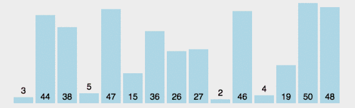
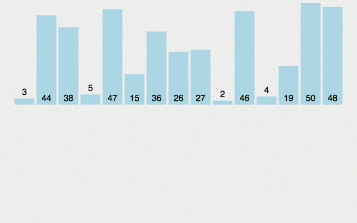
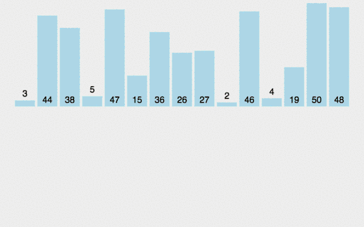
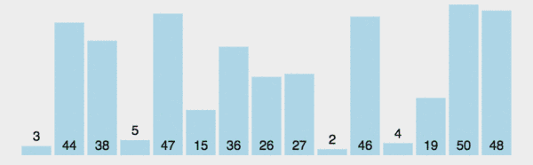

## 算法

### 冒泡排序
>思路
1. 两次循环依次比较两个相邻的数，如果第一个数比第二个数小，不变，如果第一个数比第二个数大，调换一下顺序，一轮下来最后一个数是最大的。
2. 对除了最后一个数之外的数重复第一步，直至最后一个数。
3. 2个for循环

```js
function bubbleSort(arr) {
  var len = arr.length,
      i,
      j,
      stop;
  for(i = 0, i < len -1; i++){
    for(j = 0, stop = len - 1 - i; j < stop; j++){
      if(arr[j] > arr[j + 1]){
        swap(arr, j, j + 1)
      }
    }
  }
}
function swap(arr, p1, p2){
  var temp = arr[p1];
  arr[p1] = arr[p2];
  arr[p2] = temp;
}

```


### 选择排序
>思路
1. 找出最小的数和第一个位置进行交换
2. 在剩下的数中找出第二小的数与第二个位置交换
3. 依次类推，排出顺序
4. 2个for循环

```js
function selectionSort (arr) {
  var len = arr.length,
      min;
  for(var i = 0; i < len; i++){
    min = i;
    for(var j = i + 1; j < len; j++){
      if(arr[j] < arr[min]) {
        min = j;
      }
    }
    if(i !== min){
      swap(arr, i, min)
    }
  }
}
function swap(arr, p1, p2){
  var temp = arr[p1];
  arr[p1] = arr[p2];
  arr[p2] = temp;
}
```


### 插入排序
> 思路
1. 把数组分成两个部分，已排序，未排序
2. 从未排序里抽出一个数，和已排序进行比较，插入到合适的位置
3. 2个for循环

```js
function insertionSort (arr){
  var len = arr.length,
      value, // 当前值
      i, // 未排序部分的当前位置
      j; // 已排序部分的当前位置
  for(var i = 0; i < len; i++){
    value = arr[i];
    // 拿当前值和已排序的数组比较，往前比较，如果前一个值比当前值大，那么在前一个值的后一位插入前一个值，同时自减过，前一个值等于当前值
    for(var j = i - 1; j > -1 && arr[j] > value; j--){
      arr[j + 1] = arr[j]
    }
    arr[j + 1] = value // j已经自减过
  }
}
var arr = [2,10, 5,22, 20,54, 3]
insertionSort(arr)
```



###  合并排序
> 思路
1. 不断将数组拆分，直到每个数组只有一个
2. 将分出来的部分重新合并
3. 合并的时候按顺序排列

```js
function mergeSort(arr){
  if(arr.length < 2){
    return arr
  }
  var middle = arr.length / 2,
      left = arr.slice(0, middle),
      right = arr.slice(middel);
  return merge(mergeSort(left), mergeSort(right));
}

function merge(left, rigth){
  var result = [],
      left_index = 0,
      rigth_index = 0;
  while(left_index < left.length && rigth_index < right.length){
    if(left[left_index] < right[right_index]){
      result.push(left[left_index++])
    } else{
      result.push(right[right_index++])
    }
  }
  return result.concat(left.slice(left_index)).concat(right.slice(right_index))
}
// 合并数组还是有点难度的，一下子看不明白
```



### 快速排序
> 思路 
1. 以一个数为基准（中间的数）， 比基准小的放在左边，比基准大的放在右边
2. 再按此方法对左边/右边分别进行快速排序
3. 不能再分后推出递归，然后合并数组
4. 递归

```js
function quickSort(arr) {
  if(arr.length <= 1){
    return arr
  }
  var pivotIndex = Math.floor(arr.length / 2)
  var pivot = arr.splice(pivotIndex, 1)[0];
  var left = [];
  var right = [];
  for (var i = 0; i < arr.length; i++){
    if(arr[i] < pivot){
      left.push(arr[i])
    } else {
      right.push(arr[i])
    }
  }
  return quickSort(left).concat([pivot], quickSort(right))
}
var arr = [2,10, 5,22, 20,54, 3]
var newArr = quickSort(arr)
console.log(newArr)
```
