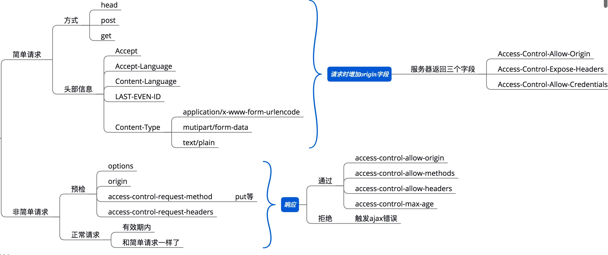

## 跨域
> 什么是跨域：因浏览器同源政策限制，不同域之间的数据交互是被禁止的，除了script元素
> 跨域的方式：8种方式

### 骨架
1. cors - 服务端设置head请求数据 allow-methods, allow-origin
2. jsonp - 动态创建script元素，请求数据，回调函数执行返回数据
3. document.domain + iframe - 设置相同主域
4. window.name + iframe - 同一个窗口的name属性共享
5. location.hash + iframe - 通过hash值传递
6. postMessage + iframe - H5新特性 postMessage onMessage
7. ngix反向代理 
8. 浏览器设置跨域 - 供开发使用

### 详情
1. cors，跨域资源共享，设置head信息

2. jsonp 
```js
  var ele = document.createElement('script');
  ele.src = 'http://xxxx.com?callback=back';
  document.getElementsByTagName('head')[0].appendChild(ele)
```
3. document.domain  
- 前置条件是必需拥有共同的顶级域名
- 不可ajax

4. ngix反向代理
- 正向代理
  设置代理服务器，对象是客户端，浏览器
- 反向代理
  浏览器不需做配置
  对象是服务端
  ngix配置rewrite
5. 浏览器设置跨域
  - 49版本之前： --disable-web-security
  - 49版本之后：在电脑上新建一个目录，例如：C:\MyChromeDevUserData，   
在属性页面中的目标输入框里加上   --disable-web-security --user-data-dir=C:\MyChromeDevUserData，--user-data-dir的值就是刚才新建的目录