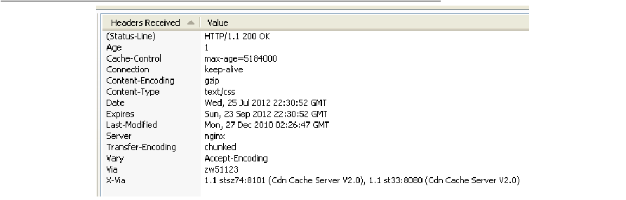

## cdn网络加速

CDN全称Content Delivery Network，即内容分发网络。其基本思路是尽可能避开互联网上有可能影响数据传输速度和稳定性的瓶颈和环节，使内容传输的更快、更稳定。通过在网络各处放置节点服务器所构成的在现有的互联网基础之上的一层智能虚拟网络，CDN系统能够实时地根据网络流量和各节点的连接、负载状况以及到用户的距离和响应时间等综合信息将用户的请求重新导向离用户最近的服务节点上。其目的是使用户可就近取得所需内容，解决 Internet 网络拥挤的状况，提高用户访问网站的响应速度。

　　在不同地域的用户访问网站的响应速度存在差异，为了提高用户访问的响应速度、优化现有Internet中信息的流动，需要在用户和服务器间加入中间层CDN。使用户能以最快的速度，从最接近用户的地方获得所需的信息，彻底解决网络拥塞，提高响应速度，是目前大型网站使用的流行的应用方案。

### CDN 概述

CDN的全称是Content Delivery Network，即内容分发网络。其目的是通过在现有的Internet中增加一层新的CACHE(缓存)层，将网站的内容发布到最接近用户的网络"边缘"的节点，使用户可以就近取得所需的内容，提高用户访问网站的响应速度。从技术上全面解决由于网络带宽小、用户访问量大、网点分布不均等原因，提高用户访问网站的响应速度。
Cache层的技术，消除数据峰值访问造成的结点设备阻塞。Cache服务器具有缓存功能，所以大部分网页对象（Web page object），如html、php等页面文件，gif、tif、png、bmp等图片文件，以及其他格式的文件，在有效期（TTL）内，对于重复的访问，不必从原始网站重新传送文件实体，只需通过简单的认证（Freshness Validation），传送几十字节的Header，即可将本地的副本直接传送给访问者。由于缓存服务器通常部署在靠近用户端，所以能获得近似局域网的响应速度，并有效减少广域带宽的消耗。不仅能提高响应速度，节约带宽，对于加速Web服务器，有效减轻源服务器的负载是非常有效的。

　　根据加速对象不同，分为：客户端加速 和 服务器加速。

　　客户端加速 : Cache部署在网络出口处，把常访问的内容缓存在本地，提高响应速度和节约带宽；

　　服务器加速 : Cache部署在服务器前端，作为Web服务器的代理缓存机，提高Web服务器的性能，加速访问速度

　　如果多台Cache加速服务器分布在不同地域，需要通过有效地机制管理Cache网络，引导用户就近访问(比如通过DNS引导用户)，全局负载均衡流量，这是CDN内容传输网络的基本思想。

　　CDN对网络的优化作用主要体现在如下几个方面：

　　1、解决服务器端的“第一公里”问题

　　2、缓解甚至消除了不同运营商之间互联的瓶颈造成的影响

　　3、减轻了各省的出口带宽压力

　　4、缓解了骨干网的压力

　　5、优化了网上热点内容的分布

　　其实大家对cdn网络加速不要觉着很神秘，其实像我们平时在生活中遇到的手机基站原理是一样的，每个地方都会有信号塔，这保障了每个地方的信号强度，cdn网络加速的原理也是这样的！

### CDN与传统网站访问的区别：

CDN主要功能是在不同的地点缓存内容，通过负载均衡技术，将用户的请求定向到最合适的缓存服务器上去获取内容，比如说，是北京的用户，我们让他访问北京的节点，深圳的用户，我们让他访问深圳的节点。通过就近访问，加速用户对网站的访问。解决Internet网络拥堵状况，提高用户访问网络的响应速度。

传统访问：

CDN访问  ：

与传统访问方式不同，CDN网络则是在用户和服务器之间增加缓存层，将用户的访问请求引导到最优的缓存节点而不是服务器源站点，从而加速访问速度。

>完整的CDN工作流程:
总结一下CDN的工作原理：通过权威DNS服务器来实现最优节点的选择，通过缓存来减少源站的压力。

　　最简单的CDN网络由一个DNS服务器和几台缓存服务器组成：

　　1、当用户点击网站页面上的内容URL，经过本地DNS系统解析，DNS系统会最终将域名的解析权交给CNAME指向的CDN专用DNS服务器。

　　2、CDN的DNS服务器将CDN的全局负载均衡设备IP地址返回用户。

　　3、用户向CDN的全局负载均衡设备发起内容URL访问请求。

　　4、CDN全局负载均衡设备根据用户IP地址，以及用户请求的内容URL，选择一台用户所属区域的区域负载均衡设备，告诉用户向这台设备发起请求。

　　5、区域负载均衡设备会为用户选择一台合适的缓存服务器提供服务，选择的依据包括：根据用户IP地址，判断哪一台服务器距用户最近；根据用户所请求的URL中携带的内容名称，判断哪一台服务器上有用户所需内容；查询各个服务器当前的负载情况，判断哪一台服务器尚有服务能力。基于以上这些条件的综合分析之后，区域负载均衡设备会向全局负载均衡设备返回一台缓存服务器的IP地址。

　　6、全局负载均衡设备把服务器的IP地址返回给用户。

　　7、用户向缓存服务器发起请求，缓存服务器响应用户请求，将用户所需内容传送到用户终端。如果这台缓存服务器上并没有用户想要的内容，而区域均衡设备依然将它分配给了用户，那么这台服务器就要向它的上一级缓存服务器请求内容，直至追溯到网站的源服务器将内容拉到本地。

### CDN应用场景

静态网页：图片小文件、博客

大文件下载：软件下载、视频点播或图片存储网站

动态加速：直播网站

应用加速：手机APP

### CDN优化
1. 动静态内容域名分离  

建议将jpg,gif,png等的图片格式、js、css、swf、htm、html等静态内容使用单独域名发布，

2. 页面静态化处理 

对于一些重要的、而且内容相对固定的网页制作为静态网页，如包含丰富关键词的网站介绍、用户帮助、网站地图等。另外一方面，可以将动态实现的网页通过一定的技术，在发布出来之后转化成静态网页，这种方式尤其适用于发布后内容无需不断更新的网页（如新闻等）

3. 按应用特性进行归类

为了便于后续在适用cdn加速时，更有针对性的配置个性化的缓存策略，建议把更新频率，单个文件大小相近的内容统一采用不同的目录或域名进行归类发布，所有内容的更新（新增修改等）操作建议自动生成全新的url，避免采用同名的方式做修改，这样可以减轻后续维护网站的工作量。

4. 网站网页结构优化建议
- 单个页面的 数据量大小控制在2M以内为最佳，总体http请求数控制在150个以内为最佳。
- 基于IE浏览器的工作原理，单个页面建议采用3-4个子域名对内容进行交叉调用，提高IE浏览器对元素的并发调用。
- 基于IE浏览器本身限制，对于js、css的加载，必须是以串行的方式加载，，即必须等前端的css及js加速完成之后才加载后面的元素。所有js和css的设计情况将直接影响这个页面的加载速度，因此，建议做一定优化，减少js和css的熟练，少使用css嵌套，尽量吧js放置页面的后面加载。

5. 多子域名时采取泛域名加速
6. 避免使用重定向
7. 网站尽量避免使用多个文件名标志同样内容的页面或文件，因为这将增加延迟。影响用户访问体验，更要的，它还可能给用户使用cdn服务后端内容刷新和同步带来一些混乱。

8. header头选项配置建议
通过合理的配置http header选项的各项参数，可以实现有效的自主管理内容在cdn节点上缓存时间。提高缓存的命中率，提高访问效果。

建议如下：
- 缓存的设置根据不同的格式设定不同的值，对于静态文件如图片文件，应尽量设置较长的缓存时间，只要确保没有同名更新即可。
- 建议通过配置cache-control：mage-age=xxx,来设置文件的过期时间，cdn节点会根据max-age来觉得文件的缓存时间，而不是通过expires,同样这样可以让IE也缓存文件。在某种程度上也能提高访问速度。同时减少304回源请求，提高平台的性能

- connection: keep-alive
对于keep-alive有做连接数限制的情况，将会导致cdn节点在回源时可能受到此连接数的限制而影响回源获取数据，导致回源异常。一般守则keep-alive的max值为3000s以上，太小容易出问题。

- Vary头
有的源服务器对于Accept-Encoding：gzip，deflate的请求，不返回vary头，根据http协议。这意味着源不让代理服务器根据用户请求进行判断返回压缩/不压缩的内容。这回导致cdn返回非压缩内容给最终用户，为解决这个问题，需要修改源服务器配置，对于没有Accept-Encoding：gzip,deflate的请求也要返回Vary头
Vary:Accept-Encoding,User-Agent