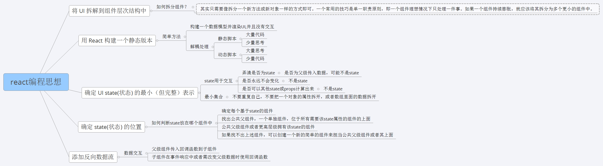

## React 思想
### 组件划分
1. UI组件
> 负责视图展示
2. 容器组件
> 负责管理数据和逻辑处理
3. react-redux中的connect组合

### 性能优化
1. 重写shouldComponentUpdate,避免不要的dom操作
2. 使用production版本的react.js
3. 使用key来帮助react识别所有子组件的最小变化

### 组件思想
