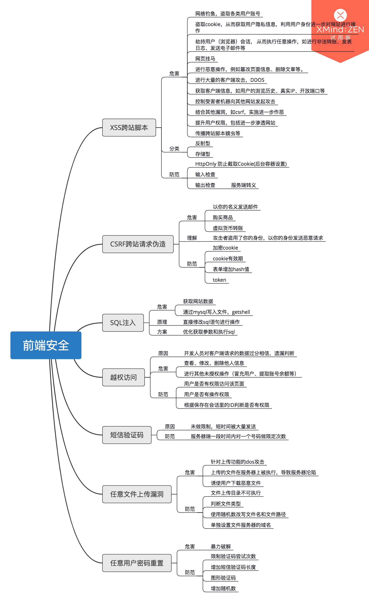

## 前端安全
### XSS跨站脚本
#### 危害
1. 网络钓鱼，盗取各类用户账号
2. 盗取cookie，从而获取用户隐私信息，利用用户身份进一步对网站进行操作
3. 劫持用户（浏览器）会话， 从而执行任意操作，如进行非法转账、发表日志、发送电子邮件等
4. 网页挂马
5. 进行恶意操作，例如篡改页面信息、删除文章等。
6. 进行大量的客户端攻击，DDOS
7. 获取客户端信息，如用户的浏览历史、真实IP、开放端口等 
8. 控制受害者机器向其他网站发起攻击
9. 结合其他漏洞，如csrf，实施进一步作恶
10. 提升用户权限，包括进一步渗透网站
11. 传播跨站脚本蠕虫等
#### 分类
1. 反射型
2. 存储型
#### 防范
1. HttpOnly 防止截取Cookie(后台容器设置)
2. 输入检查
3. 输出检查 - 服务端转义
   
### CSRF跨站请求伪造
#### 危害
1. 以你的名义发送邮件
2. 购买商品
3. 虚拟货币转账
#### 原理
1. 攻击者盗用了你的身份，以你的身份发送恶意请求
#### 防范
1. 加密cookie
2. cookie有效期
3. 表单增加hash值
4. token
### SQL注入
#### 危害
1. 获取网站数据
2. 通过mysql写入文件，getshell
#### 原理
直接修改sql语句进行操作
#### 防范
优化获取参数和执行sql

### 越权访问
#### 危害
1. 查看、修改、删除他人信息
2. 进行其他未授权操作（冒充用户、提取账号余额等）

#### 原因
1. 开发人员对客户端请求的数据过分相信，遗漏判断
#### 防范
1. 用户是否有权限访问该页面
2. 用户是否有操作权限
3. 根据保存在会话里的ID判断是否有权限

### 短信验证码
#### 原因
未做限制，短时间被大量发送
#### 防范
服务器端一段时间内对一个号码做限定次数

### 任意文件上传漏洞
#### 危害
1. 针对上传功能的dos攻击
2. 上传的文件在服务器上被执行，导致服务器沦陷
3. 诱使用户下载恶意文件
#### 防范
1. 文件上传目录不可执行
2. 判断文件类型
3. 使用随机数改写文件名和文件路径
4. 单独设置文件服务器的域名
### 任意用户密码重置
#### 危害
暴力破解
#### 防范
1. 限制验证码尝试次数
2. 增加短信验证码长度
3. 图形验证码
4. 增加随机数

整理了一下前端安全问题，看导图  
