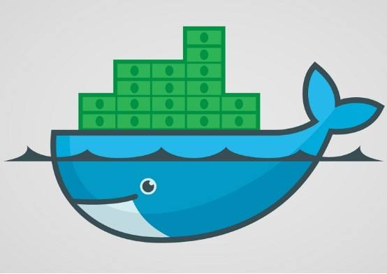

## 什么是docker

### 定义
 docker是一个开源的应用容器引擎，可以为我们提供安全、可移植、可重复的自动化部署的方式。docker采用虚拟化的技术来虚拟化出应用程序的运行环境。如上图一样。docker就像一艘轮船。而轮船上面的每个小箱子可以看成我们需要部署的一个个应用。使用docker可以充分利用服务器的系统资源，简化了自动化部署和运维的繁琐流程,减少很多因为开发环境中和生产环境中的不同引发的异常问题。从而提高生产力。

### 核心
docker三个核心概念如下：

镜像（images）：一个只读的模板，可以理解为应用程序的运行环境，包含了程序运行所依赖的环境和基本配置。相当于上图中的每个小箱子里面装的东西。

仓库（repository）：一个用于存放镜像文件的仓库。可以看做和gitlab一样。

容器（container）：一个运行应用程序的虚拟容器，他和镜像最大的区别在于容器的最上面那一层是可读可写的。 相当于上图中的每个小箱子。