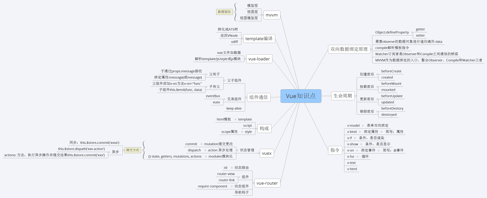

## Vue 架构
### 生命周期
```js
Vue.prototype._init = function(options) {
    initLifecycle(vm)
    initEvents(vm)
    initRender(vm)
    callHook(vm, 'beforeCreate') // 拿不到 props data
    initInjections(vm) 
    initState(vm)
    initProvide(vm)
    callHook(vm, 'created')
}
```

### 双向绑定原理
- 在初始化 data props 时，递归对象，给每一个属性双向绑定，对于数组而言，会拿到原型重写函数，实现手动派发更新。因为函数不能监听到数据的变动，和 proxy 比较一下。
- 除了以上数组函数，通过索引改变数组数据或者给对象添加新属性也不能触发，需要使用自带的set 函数，这个函数内部也是手动派发更新
- 在组件挂载时，会实例化渲染观察者，传入组件更新的回调。在实例化过程中，会对模板中的值对象进行求值，触发依赖收集。在触发依赖之前，会保存当前的渲染观察者，用于组件含有子组件的时候，恢复父组件的观察者。触发依赖收集后，会清理掉不需要的依赖，性能优化，防止不需要的地方去重复渲染。
- 改变值会触发依赖更新，会将收集到的所有依赖全部拿出来，放入 nextTick 中统一执行。执行过程中，会先对观察者进行排序，渲染的最后执行。先执行 beforeupdate 钩子函数，然后执行观察者的回调。在执行回调的过程中，可能 watch 会再次 push 进来，因为存在在回调中再次赋值，判断无限循环。

### v-model原理
- v:model 在模板编译的时候转换代码
- v-model 本质是 :value 和 v-on，但是略微有点区别。在输入控件下，有两个事件监听，输入中文时只有当输出中文才触发数据赋值
- v-model 和:bind 同时使用，前者优先级更高，如果 :value 会出现冲突
- v-model 因为语法糖的原因，还可以用于父子通信

### watch和computer区别和运用的场景
- 前者是计算属性，依赖其他属性计算值。并且 computer 的值有缓存，只有当计算值变化才变化触发渲染。后者监听到值得变化就会执行回调
- computer 就是简单计算一下，适用于渲染页面。watch 适合做一些复杂业务逻辑
- 前者有依赖两个 watcher，computer watcher 和渲染 watcher。判断计算出的值变化后渲染 watcher 派发更新触发渲染
### Vue 的父子通信  
- 使用 v-model 实现父传子，子传父。因为 v-model 默认解析成 :value 和 :input
- 父传子
  - 通过 props
  - 通过 $children 访问子组件数组，注意该数组乱序
  - 对于多级父传子，可以使用 v-bind={$attrs} ，通过对象的方式筛选出父组件中传入但子组件不需要的 props
  - $listens 包含了父作用域中的 (不含 .native 修饰器的) v-on 事件监听器。
  
- 子传父
  - 父组件传递函数给子组件，子组件通过 $emit 触发
  - 修改父组件的 props
  - 通过 $parent 访问父组件
  - .sync

- 平行组件
  - EventBus
- Vuex 解决一切

### 路由原理
前端路由实现起来其实很简单，本质就是监听 URL 的变化，然后匹配路由规则，显示相应的页面，并且无须刷新。目前单页面使用的路由就只有两种实现方式
1. hash模式

2. history模式



### MVVM
MVVM 由以下三个内容组成
- View：界面
- Model：数据模型
- ViewModel：作为桥梁负责沟通 View 和 Model

在 JQuery 时期，如果需要刷新 UI 时，需要先取到对应的 DOM 再更新 UI，这样数据和业务的逻辑就和页面有强耦合。
在 MVVM 中，UI 是通过数据驱动的，数据一旦改变就会相应的刷新对应的 UI，UI 如果改变，也会改变对应的数据。这种方式就可以在业务处理中只关心数据的流转，而无需直接和页面打交道。ViewModel 只关心数据和业务的处理，不关心 View 如何处理数据，在这种情况下，View 和 Model 都可以独立出来，任何一方改变了也不一定需要改变另一方，并且可以将一些可复用的逻辑放在一个 ViewModel 中，让多个 View 复用这个 ViewModel。
在 MVVM 中，最核心的也就是数据双向绑定，例如 Angluar 的脏数据检测，Vue 中的数据劫持。

### 路由鉴权
- 登录页和其他页面分开，登录以后实例化 Vue 并且初始化需要的路由
- 动态路由，通过 addRoute 实现

### Vue 和 React 区别

- Vue 表单支持双向绑定开发更方便
- 改变数据方式不同，setState 有使用坑
- props Vue 可变，React 不可变
- 判断是否需要更新 React 可以通过钩子函数判断，Vue 使用依赖追踪，修改了什么才渲染什么
- React 16以后 有些钩子函数会执行多次
- React 需要使用 JSX，需要 Babel 编译。Vue 虽然可以使用模板，但是也可以通过直接编写 render 函数不需要编译就能运行。
- 生态 React 相对较好